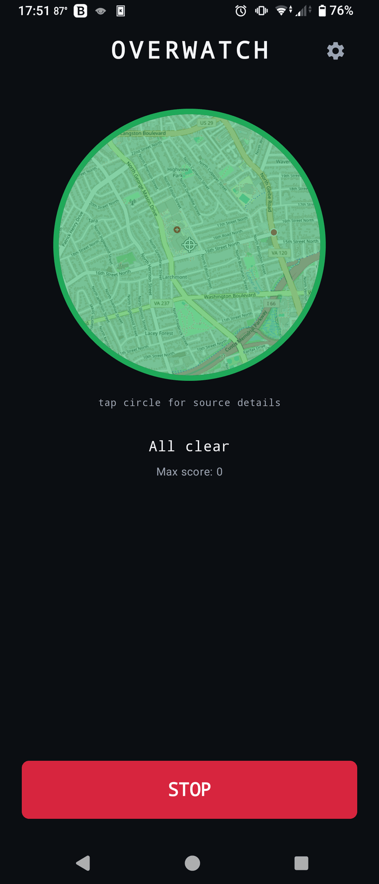
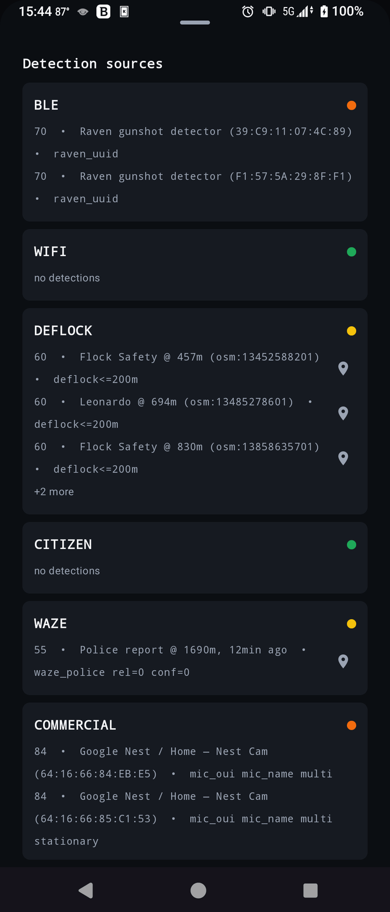
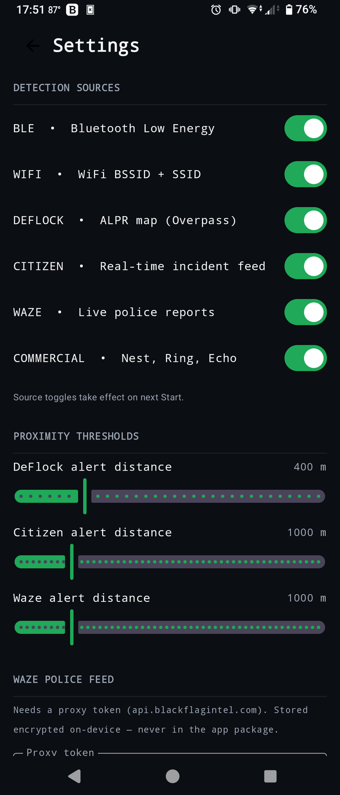

# OVERWATCH

A native Android (Kotlin) **passive surveillance-detection** app. Open it, hit
**START**, and a circle turns **green / yellow / orange / red** depending on
how confident the engine is that there's a Flock Safety ALPR, an Axon body
camera, or active police presence near you. With the screen locked, the
foreground notification updates with the current tier and the phone vibrates
on upward escalations — you don't have to be looking at the screen.

> **Passive defense only.** OVERWATCH only listens — it does not transmit,
> probe, jam, or interfere with any device or network. The Axon
> advertise/fuzz code from one of the reference projects is intentionally
> excluded.

Website: **[overwatch.netslum.io](https://overwatch.netslum.io)**  ·  Latest release: [v0.5.3](https://github.com/KaraZajac/OVERWATCH/releases) (debug-signed APK, sideload).

---

## Screenshots

<p align="center">
  
  &nbsp;&nbsp;
  
  &nbsp;&nbsp;
  
</p>

<p align="center"><sub>Live threat-map circle · source drill-down · settings</sub></p>

---

## What it detects

| Source | What it looks at | Where it comes from |
|---|---|---|
| **BLE** | Bluetooth-LE advertisements: vendor MAC OUIs (Axon, Flock Penguin / Raven, XUNTONG mfg id `0x09C8`, "TN" serial pattern), Raven service UUIDs, device-name patterns | Local radio scan (BLE callback API). Iterates every manufacturer-specific data entry to find XUNTONG, not just the first. |
| **WiFi** | BSSID OUI prefixes for Flock infrastructure (31-prefix superset), `Flock-XXXX` and other generic SSID patterns | `WifiManager.getScanResults()` polled every 35 s (just under the Android 11+ 4-scans/2-min throttle) |
| **DEFLOCK** | Crowdsourced ALPR locations within configurable proximity (default 200 m) | POST to Overpass API (`overpass.deflock.org` → fallback `overpass-api.de`) for `man_made=surveillance + surveillance:type=ALPR` in a 5 km bbox; 24 h on-disk cache by 0.05° grid cell. Refetches when the user moves > 1.5 km from the last fetch center. Backoffs after Overpass failures; treats `{"remark": "...timed out..."}` 200-responses as failure so timeouts don't poison the cache. |
| **CITIZEN** | Real-time public-safety incidents (police-relevant only — fire/medical-only events filtered out) within configurable proximity, < 30 min old | `citizen.com/api/incident/trending` (bbox) polled every 60 s, then per-incident detail via `/api/incident/{id}` with an in-memory cache so each incident is fetched once per session. First poll fires immediately on the first location fix. |
| **WAZE** | User-reported `POLICE` alerts still active in the feed within configurable proximity (default 500 m), up to ~45 min old | `api.blackflagintel.com/waze/alerts-and-jams` — the OVERWATCH proxy (Caddy) that injects the OpenWeb Ninja key server-side and forwards to their hosted Waze scrape, sidestepping the reCAPTCHA gating that 403s direct `live-map/api/georss` calls. The app authenticates with an `X-App-Token` entered in Settings (encrypted on-device); the paid key never ships in the APK. Polled every ~4 min. Upstream ignores type filtering and caps at 200 alerts, so the client pulls the full page and filters to `POLICE` itself. Alerts carry confidence (0–5) + reliability (0–10); high values nudge the score up. No token → source shows "not configured" in the drill-down. |
| **COMMERCIAL** | Nearby consumer smart-home / voice gear (Nest, Ring, Echo, hidden cams) and camera-bearing smart glasses (Meta, Snap, Vuzix) as a secondary situational signal | Rides the BLE + WiFi scans — OUI / device-name / service-UUID / SSID matches plus Bluetooth SIG company IDs from `MicTargets`. Score-capped at ORANGE so a cluster of doorbells (or a passing pair of Ray-Bans) never reads as ALPR-grade certainty. |

> **Waze is back (v0.4.0+), via a key-protected proxy.** Waze reCAPTCHA-gated its `live-map/api/georss` endpoint in 2025/2026 — automated calls get HTTP 403 regardless of IP or headless-vs-headful browser (it scores browser *reputation*, verified by direct testing), which is why v0.1.5 removed the original integration and why no free scraper survives. OVERWATCH reads Waze POLICE alerts through [OpenWeb Ninja](https://www.openwebninja.com)'s hosted feed (pay-as-you-go ~$0.005/req, ≈ $1–3/mo at the 4-min poll). To keep the paid key off every device, the app doesn't hold it: a Caddy reverse proxy at `api.blackflagintel.com` injects the key server-side, and the app authenticates with a scoped, revocable `X-App-Token` entered in Settings (stored encrypted via the Android Keystore). The Waze for Cities partner feed was ruled out — it excludes POLICE and is agency-only. Waze complements Citizen: denser for roadway stops / speed traps.

Every observation is scored 0–100 by `ConfidenceEngine`. The on-screen tier is
the maximum live score across all sources:

```
GREEN      < 40    nothing credible
YELLOW   40 – 69   single weak indicator
ORANGE   70 – 84   high confidence
RED        85 +    certain
```

The user-facing circle uses the full 4-tier mapping. Cross-source corroboration
naturally pushes the global max upward (a BLE OUI hit *and* a DeFlock map
match in the same area produce a higher tier than either alone). When idle,
the circle shows muted gray with `IDLE` text so it's distinguishable at a
glance from "scanning, all clear."

While scanning, the circle becomes a live OpenStreetMap centered on you, wrapped
in a **threat-color ring** (the current tier at a glance) and marked with a ⌖
crosshair for your position. Map geodata is color-coded by source — **Flock /
DeFlock cameras red, Waze police blue, Citizen incidents purple** — so each dot
is self-explanatory. The same map renders in a smaller floating overlay bubble
(Settings → Display over other apps) so it works over other apps.

---

## How alerts work

- **In-app**: the threat circle shows a live map with a threat-color ring and
  source-color dots while scanning; tap it to open the bottom-sheet drill-down
  with per-source rows. DeFlock, Citizen, and Waze events carry coordinates —
  each row has a tap-to-open Maps icon.
- **Foreground notification**: rebuilt on every threat-tier change. Title
  becomes `OVERWATCH • RED` (or whatever tier); text shows the top
  detection's score + label. Notification priority bumps to HIGH on RED so
  the system can surface it as a heads-up.
- **Vibration**: on upward tier transitions only. Short pulse for YELLOW,
  double for ORANGE, escalating triple for RED. Toggle in Settings → Alerts.
- **Per-source health**: the drill-down sheet shows orange `Source unreachable`
  text on a row when its scanner couldn't reach its data source — silent
  empty results vs. real failures are distinguishable.

---

## Architecture

```
ui/MainScreen.kt                   map circle + threat ring + START/STOP + drill-down sheet
ui/OverlayBubble.kt                floating "chat-bubble" version of the map circle
ui/MarkerIcons.kt                  map marker drawables — source dots + ⌖ user crosshair
ui/SettingsScreen.kt               source toggles, distance sliders, Waze token, vibrate, theme
ui/theme/Theme.kt                  Material 3 dark/light + threat colors
service/DetectionService.kt        foreground service — owns scanners, notification, vibration
service/OverlayManager.kt          WindowManager host for the floating overlay bubble
scan/BleScanner.kt                 BLE callback scanner
scan/WifiScanner.kt                WifiManager poller + SCAN_RESULTS receiver
scan/DeflockClient.kt              Overpass POST (deflock.org → overpass-api.de) + 24h cache
scan/DeflockScanner.kt             location-driven proximity check + failure backoff
scan/CitizenClient.kt              GET /api/incident/trending + /api/incident/{id}
scan/CitizenScanner.kt             60 s poller, fire/medical filter, per-id cache
scan/WazeClient.kt                 GET api.blackflagintel.com proxy (X-App-Token) → OpenWeb Ninja
scan/WazeScanner.kt                ~4 min poller, 200-alert page, client-side POLICE filter
fusion/ConfidenceEngine.kt         scoring (BLE / WiFi / DeFlock / Citizen / Waze / Commercial)
fusion/RssiTracker.kt              rise-peak-fall stationary-signal detector
fusion/DetectionStore.kt           in-memory dedup, 5-min retention, max-tier flow
fusion/SourceHealth.kt             per-source OK/FAILED registry for the drill-down
fusion/ThreatLevel.kt              4-tier enum + DetectionSource enum
data/location/LocationProvider.kt  FusedLocationProviderClient wrapper
data/settings/Settings.kt          SharedPreferences-backed StateFlow settings
data/settings/SecureStore.kt       Keystore AES/GCM store for the Waze proxy token
data/targets/                      BleOuis, WifiOuis, RavenUuids, Patterns, Manufacturers, MicTargets
```

No detection-history database. All state is in-memory and clears on stop, by
design. Service uses `START_NOT_STICKY` — system kill doesn't auto-restart
into a stuck state.

---

## Build & install

Requires:
- **JDK 17** (17 or 21; Android Gradle Plugin 8.7.x rejects JDK 26)
- **Android Studio** with SDK Platform 35 + Build-Tools 35.x + Platform-Tools

```sh
# 1) Copy the example local.properties and point sdk.dir at your install
cp local.properties.example local.properties
# edit local.properties → sdk.dir=/Users/<you>/Library/Android/sdk
# (Waze needs no build config — paste the proxy token into Settings in-app)

# 2) Make sure JAVA_HOME is JDK 21
export JAVA_HOME=/usr/local/opt/openjdk@21/libexec/openjdk.jdk/Contents/Home

# 3) Build & install on a connected device with USB debugging
./gradlew :app:installDebug
```

Or download the latest debug-signed APK from
[Releases](https://github.com/KaraZajac/OVERWATCH/releases).

Releases are cut by CI: pushing a `v*` tag runs `.github/workflows/release.yml`,
which builds `:app:assembleDebug` and attaches the APK to a GitHub Release. No
build-time secrets — the app ships with no key or token. A fixed `debug.keystore`
is committed (a debug key is non-secret; password is the well-known `android`) so
every build — CI or local — signs identically and updates install in place
without an uninstall.

---

## Permissions

| Permission | Why |
|---|---|
| `BLUETOOTH_SCAN`, `BLUETOOTH_CONNECT` (API 31+) | BLE scanning |
| `BLUETOOTH`, `BLUETOOTH_ADMIN` (≤ API 30) | BLE scanning, legacy |
| `ACCESS_FINE_LOCATION` | Required for BLE pre-S, WiFi pre-T, and DeFlock/Citizen proximity |
| `NEARBY_WIFI_DEVICES` (API 33+) | WiFi scan results without using location |
| `ACCESS_WIFI_STATE`, `CHANGE_WIFI_STATE` | Trigger and read scan results |
| `INTERNET`, `ACCESS_NETWORK_STATE` | DeFlock Overpass, Citizen API, Waze proxy |
| `FOREGROUND_SERVICE`, `FOREGROUND_SERVICE_CONNECTED_DEVICE`, `FOREGROUND_SERVICE_LOCATION` | Keep scanning with the screen off |
| `POST_NOTIFICATIONS` (API 33+) | Foreground-service notification |
| `VIBRATE` | Haptic alert on threat-tier escalation |
| `SYSTEM_ALERT_WINDOW` | Optional floating threat-circle overlay (special-access; granted via system settings) |

Requested at runtime when you press START for the first time. If you
permanently deny a required permission ("don't ask again"), the START button
swaps to **Open app settings** which fires the per-app system-settings page
so you can grant manually.

---

## Settings

Tap the gear icon in the top-right.

- **Detection sources**: toggle BLE / WiFi / DeFlock / Citizen / Waze / Commercial independently.
  Changes take effect on the next Start. While scanning, a **Restart scan to
  apply** button appears that does `stop()` + `start()` in one tap.
- **Proximity thresholds** (sliders commit on release, not per-pixel):
  - DeFlock: 50 m – 1600 m (default 200 m)
  - Citizen: 100 m – 5000 m (default 500 m)
  - Waze: 100 m – 5000 m (default 500 m)
- **Waze police feed**: paste the `api.blackflagintel.com` proxy token. It's
  stored encrypted on-device (Android Keystore), never baked into the APK; the
  paid OpenWeb Ninja key stays server-side on the proxy. Empty = Waze source off.
- **Alerts**:
  - Vibrate on threat escalation (default on)
- **Display over other apps**: floating threat-circle overlay (needs the
  special-access permission; the app bounces you to the system page to grant it).
- **Appearance**: System / Dark / Light (default Dark)

---

## Reference repos studied while building

These live under `REFERENCES/` (gitignored):

- **AxonCadabra** — BLE scanner skeleton (scan side only; advertise/fuzz code excluded)
- **flock-detection** — confidence-scoring algorithm (highest reusability), RSSI rise-peak-fall, OUIs + UUIDs + patterns
- **flock-you** — 31-OUI WiFi superset (promiscuous-mode tricks not portable to Android)
- **deflock** + **deflock-app** — Overpass query format + proximity-alert pattern (the Flutter app uses Overpass directly, not the CDN tiles, which the OVERWATCH client mirrors)
- **wazepolice** — original live-map/api/georss recipe; that endpoint is now reCAPTCHA-gated, so v0.5.0 re-added Waze via the OpenWeb Ninja proxy (`api.blackflagintel.com`) instead of hitting Waze directly

---

## Status

Phases 1–5 (skeleton, BLE, WiFi, DeFlock, Citizen, polish) complete and
field-tested. Current release **v0.5.1**. Notable changes:

- v0.1.2 — Android 14+ foreground service type fix; NaN-coordinate filter on map data.
- v0.1.3 — DeFlock CDN replaced by direct Overpass calls (Cloudflare-blocked).
- v0.1.4 — Citizen.com added as 5th source, per-source health registry.
- v0.1.5 — Waze removed (reCAPTCHA-gated; no clean mobile workaround at the time).
- v0.1.6 — Dynamic notification with tier + label, haptic alerts, Open-in-Maps for geo events.
- v0.1.7 — System back from Settings returns to MAIN instead of exiting.
- v0.2.0 — Live map circle + COMMERCIAL source (Nest / Ring / Echo / hidden cams).
- v0.2.1–v0.2.2 — Live proximity refresh, map dot markers, map + Settings UI polish.
- v0.3.0–v0.3.2 — Floating threat-circle overlay (chat-bubble style) + drag/crash fixes.
- v0.5.0 — Waze re-added via a key-protected Caddy proxy (`api.blackflagintel.com`): the OpenWeb Ninja key stays server-side, the app uses an encrypted per-device token. GitHub Actions release pipeline added.
- v0.5.1 — UI: larger map circle with a threat-color ring, ⌖ user crosshair, source-color dots (Flock red / Waze blue / Citizen purple), START moved to the bottom.
- v0.5.2 — Committed a fixed debug keystore so CI + local builds sign identically; updates now install in place (no functional changes).
- v0.5.3 — Detect Meta / Snap / Vuzix smart glasses in the COMMERCIAL source (BLE company-id + name vectors); new radar app icon (launcher, themed, and notification).

## License

Personal use. Reference repos retain their own licenses; do not redistribute
their code as part of this project.

## Disclaimer

Tool for situational awareness about deployed surveillance infrastructure in
public spaces. Local laws regarding electronic surveillance, RF monitoring, and
police-tracking apps vary — your responsibility to know what's legal where you
are.
