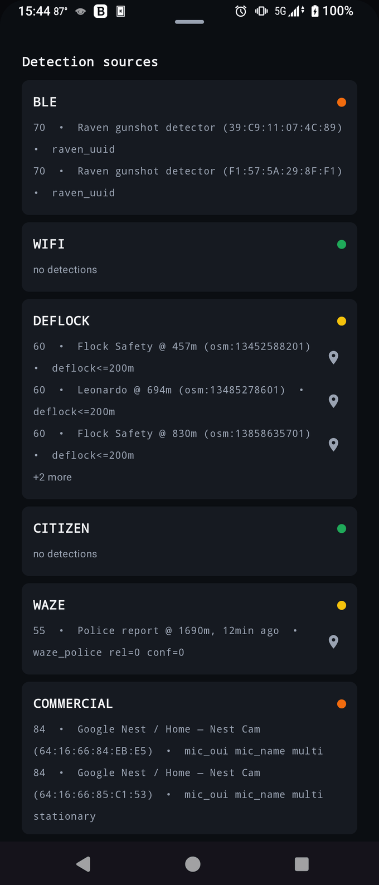
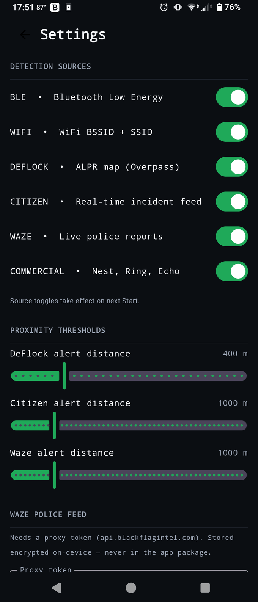

# OVERWATCH

A native Android (Kotlin) **passive surveillance-detection** app. Open it, hit
**START**, and a circle turns **green / yellow / orange / red** depending on
how confident the engine is that there's a Flock Safety ALPR, an Axon body
camera, or active police presence near you. With the screen locked, the
foreground notification updates with the current tier and the phone vibrates
on upward escalations — you don't have to be looking at the screen.

> **Passive defense only.** OVERWATCH only listens — it does not transmit,
> probe, jam, or interfere with any device or network. The Axon
> advertise/fuzz code from one of the reference projects is intentionally
> excluded.

Website: **[overwatch.netslum.io](https://overwatch.netslum.io)**  ·  Latest release: [v0.5.7](https://github.com/KaraZajac/OVERWATCH/releases) (debug-signed APK, sideload).

---

## Screenshots

<p align="center">
  
  &nbsp;&nbsp;
  
  &nbsp;&nbsp;
  
</p>

<p align="center"><sub>Live threat-map circle · source drill-down · settings</sub></p>

---

## What it detects

| Source | What it looks at | Where it comes from |
|---|---|---|
| **BLE** | Bluetooth-LE advertisements: vendor MAC OUIs (Axon, Flock Penguin / Raven, XUNTONG mfg id `0x09C8`, "TN" serial pattern), Raven service UUIDs, device-name patterns — plus 18 IEEE-verified surveillance-vendor OUIs (ShotSpotter, WatchGuard/Motorola, Verkada, Avigilon Alta, Axis body cams, FLIR, Hanwha, March Networks, GeoVision, Mobotix, Sunell) with vendor-named labels | Local radio scan (BLE callback API). Iterates every manufacturer-specific data entry to find XUNTONG, not just the first. **Screen off:** Android suspends unfiltered scans, so the scanner switches to a filtered scan (Raven UUIDs, XUNTONG, mic company ids); OUI-prefix and name matching resume when the screen is on — see [SOURCES.md §5.1](SOURCES.md). Police-exclusive OUIs (WatchGuard, ShotSpotter) score ORANGE on sight, same rationale as Axon. |
| **WiFi** | BSSID OUI prefixes for Flock infrastructure (31-prefix superset) + the same 18 vendor OUIs (WatchGuard 4RE in-car APs, Openpath/Alta readers, WiFi-capable cameras), `Flock-XXXX` and other generic SSID patterns | `WifiManager.getScanResults()` polled every 35 s (just under the Android 11+ 4-scans/2-min throttle) |
| **DEFLOCK** | Crowdsourced ALPR locations within the detection radius (default 500 m), scored by how close each one actually is | POST to Overpass API (`overpass.deflock.org` → fallback `overpass-api.de`) for `man_made=surveillance + surveillance:type=ALPR` in a 5 km bbox; 24 h on-disk cache by 0.05° grid cell. Refetches when the user moves > 1.5 km from the last fetch center. Backoffs after Overpass failures; treats `{"remark": "...timed out..."}` 200-responses as failure so timeouts don't poison the cache. |
| **WAZE** | User-reported `POLICE` alerts still active in the feed within the detection radius (default 500 m), up to ~45 min old, scored by distance and age | `api.openwebninja.com/waze/alerts-and-jams` — [OpenWeb Ninja](https://www.openwebninja.com)'s hosted Waze feed, called directly with **your own API key** (`X-API-Key`) entered in Settings and stored encrypted on-device. Sidesteps the reCAPTCHA gating that 403s direct `live-map/api/georss` calls. Polled every ~4 min with `alert_types=POLICE&max_jams=0` (server-side filtering, ~1.5 KB/poll), and the client re-filters by type so a silent upstream change can't let other alert types through. Alerts carry confidence (0–5) + reliability (0–10); high values nudge the score up. No key → source shows "not configured" in the drill-down. |
| **AIRCRAFT** | Police / surveillance aircraft overhead — identified from a bundled registry of 1,971 US law-enforcement airframes, plus loiter detection for unlisted ones | `opendata.adsb.fi` → fallback `api.adsb.lol`, polled every 60 s. **No API key.** Community ADS-B networks are used specifically because the commercial trackers filter law-enforcement flights at government request. Matched on the ICAO 24-bit address; scored by ground distance, altitude and orbit behaviour. |
| **COMMERCIAL** | Nearby consumer smart-home / voice gear (Nest, Ring, Echo, hidden cams) and camera-bearing smart glasses (Meta, Snap, Vuzix) as a secondary situational signal | Rides the BLE + WiFi scans — OUI / device-name / service-UUID / SSID matches plus Bluetooth SIG company IDs from `MicTargets`. Score-capped at ORANGE so a cluster of doorbells (or a passing pair of Ray-Bans) never reads as ALPR-grade certainty. |

> **Citizen was removed (v0.5.7).** Citizen ended the police-dispatch data
> partnership behind its public feed in June 2026. It first degraded to silent
> empty stubs, and as of **2026-09-16** `citizen.com/api/incident/trending`
> returns **HTTP 410 Gone — `{"error":"This endpoint has been removed."}`**,
> which is upstream formally tombstoning it. `data.sp0n.io` (the host the
> current web app uses) answers 200 with a zero-byte body even with no query
> params. Structured incident data is now Citizen's paid Enterprise API only,
> which needs a business use-case application — not something this app can
> ship. The source and all its code were therefore deleted rather than left
> as a permanently-failing row. Police presence is still covered by Waze
> (denser for roadway stops anyway) and DeFlock.

> **Waze needs your own API key (v0.5.6+).** Waze reCAPTCHA-gated its `live-map/api/georss` endpoint in 2025/2026 — automated calls get HTTP 403 regardless of IP or headless-vs-headful browser (it scores browser *reputation*, verified by direct testing), which is why v0.1.5 removed the original integration and why no free scraper survives. OVERWATCH reads Waze POLICE alerts through [OpenWeb Ninja](https://www.openwebninja.com)'s hosted feed. Earlier builds routed this through a private proxy that injected a shared key, which meant handing out a credential that wasn't the user's; **v0.5.6 calls OpenWeb Ninja directly with a key you supply yourself** — see [Waze setup](#waze-setup-bring-your-own-api-key) below. Nothing is baked into the APK, so a published build carries no credential and each install bills to its own account. The Waze for Cities partner feed was ruled out — it excludes POLICE and is agency-only.

> **Full reference:** [SOURCES.md](SOURCES.md) documents every endpoint, every
> BLE/WiFi identifier, the scoring tables, and the sources that were tried and
> rejected (and why).

Every observation is scored 0–100 by `ConfidenceEngine`. The on-screen tier is
the maximum live score across all sources:

```
GREEN      < 40    nothing credible
YELLOW   40 – 69   single weak indicator
ORANGE   70 – 84   high confidence
RED        85 +    certain
```

**DeFlock and Waze are scored on a sliding scale, not a flat value.** Both
carry real coordinates, so the score is a continuous falloff over the actual
distance — drive toward a camera and the number climbs, drive past and it
drops. The anchors are absolute metres and deliberately independent of the
detection-radius setting: a camera 200 m away is equally close whether the
slider reads 300 m or 5 km, so moving a setting must never move the threat
level. A Waze report additionally decays by up to 12 points across its 45-min
freshness window, because police move and a surveyed camera does not.

| Distance | DeFlock ALPR | Waze police (fresh) |
|---|---|---|
| 0 m | 95 RED | 80 ORANGE |
| 50 m | 85 RED | 78 ORANGE |
| 100 m | 72 ORANGE | 70 ORANGE |
| 200 m | 55 YELLOW | 62 YELLOW |
| 350 m | 42 YELLOW | 52 YELLOW |
| 500 m | 35 GREEN | 47 YELLOW |
| 1000 m | 26 GREEN | 34 GREEN |
| 3000 m | 18 GREEN | 23 GREEN |

Each curve crosses below the YELLOW line (40) at roughly the distance the thing
stops being able to act on you. A Flock camera reads plates at ~30–50 m, so it
is RED on top of it, ORANGE at 100 m, and GREEN by 500 m — still drawn on the
map, just not an alarm. Waze keeps a wider band on purpose: a police car covers
700 m in under a minute; a bollarded camera never moves.

**This calibration is what makes a single range slider safe.** The tier is
`max(score)` over everything reported, and the slider decides what gets
reported — so with looser curves, standing still and dragging it from 300 m to
500 m flipped the app GREEN → YELLOW with nothing physical changing. Now
sweeping 200 m → 4900 m leaves the tier untouched, while standing 29 m from a
camera still reads **89 RED**.

The user-facing circle uses the full 4-tier mapping. Cross-source corroboration
naturally pushes the global max upward (a BLE OUI hit *and* a DeFlock map
match in the same area produce a higher tier than either alone). When idle,
the circle shows muted gray with `IDLE` text so it's distinguishable at a
glance from "scanning, all clear."

While scanning, the circle becomes a live OpenStreetMap centered on you, wrapped
in a **threat-color ring** (the current tier at a glance) and marked with a ⌖
crosshair for your position. Map geodata is color-coded by source — **Flock /
DeFlock ALPR red, speed cameras amber, other cameras gray, Waze police blue,
aircraft violet** — so each dot
is self-explanatory. The same map renders in a smaller floating overlay bubble
(Settings → Display over other apps) so it works over other apps.

---

## How alerts work

- **In-app**: the threat circle shows a live map with a threat-color ring and
  source-color dots while scanning, with a legend beneath it — **ALPR red,
  speed camera amber, generic camera gray, Waze police blue, aircraft violet**,
  and a ⌖ crosshair for your own position; tap it to open the bottom-sheet drill-down
  with per-source rows. DeFlock and Waze events carry coordinates —
  each row has a tap-to-open Maps icon.
- **Foreground notification**: rebuilt on every threat-tier change. Title
  becomes `OVERWATCH • RED` (or whatever tier); text shows the top
  detection's score + label. Notification priority bumps to HIGH on RED so
  the system can surface it as a heads-up.
- **Vibration**: on upward tier transitions only. Short pulse for YELLOW,
  double for ORANGE, escalating triple for RED. Toggle in Settings → Alerts.
- **Per-source health**: the drill-down sheet shows orange `Source unreachable`
  text on a row when its scanner couldn't reach its data source — silent
  empty results vs. real failures are distinguishable.

---

## Architecture

```
ui/MainScreen.kt                   map circle + threat ring + START/STOP + drill-down sheet
ui/OverlayBubble.kt                floating "chat-bubble" version of the map circle
ui/MarkerIcons.kt                  map marker drawables — source dots + ⌖ user crosshair
ui/SettingsScreen.kt               source toggles, distance sliders, Waze API key, vibrate, theme
ui/theme/Theme.kt                  Material 3 dark/light + threat colors
service/DetectionService.kt        foreground service — owns scanners, notification, vibration
service/OverlayManager.kt          WindowManager host for the floating overlay bubble
scan/BleScanner.kt                 BLE callback scanner
scan/WifiScanner.kt                WifiManager poller + SCAN_RESULTS receiver
scan/DeflockClient.kt              Overpass POST (deflock.org → overpass-api.de) + 24h cache
scan/DeflockScanner.kt             location-driven proximity check + failure backoff
scan/WazeClient.kt                 GET api.openwebninja.com (X-API-Key, user's own key)
scan/AircraftClient.kt             GET adsb.fi → adsb.lol (no key), live ADS-B contacts
scan/AircraftScanner.kt            60 s poller, registry match + loiter/orbit detection
data/targets/LeAircraft.kt         bundled ICAO-hex table of law-enforcement aircraft
scan/WazeScanner.kt                ~4 min poller, 200-alert page, client-side POLICE filter
fusion/ConfidenceEngine.kt         scoring (BLE / WiFi / DeFlock / Waze / Commercial)
fusion/RssiTracker.kt              rise-peak-fall stationary-signal detector
fusion/DetectionStore.kt           in-memory dedup, 5-min retention, max-tier flow
fusion/SourceHealth.kt             per-source OK/FAILED registry for the drill-down
fusion/ThreatLevel.kt              4-tier enum + DetectionSource enum
data/location/LocationProvider.kt  FusedLocationProviderClient wrapper
data/settings/Settings.kt          SharedPreferences-backed StateFlow settings
data/settings/SecureStore.kt       Keystore AES/GCM store for the Waze API key
data/targets/                      BleOuis, WifiOuis, VendorOuis, RavenUuids, Patterns, Manufacturers, MicTargets
```

No detection-history database. All state is in-memory and clears on stop, by
design. Service uses `START_NOT_STICKY` — system kill doesn't auto-restart
into a stuck state.

---

## Waze setup (bring your own API key)

The Waze source is optional and off until you give it a key. It reads
[OpenWeb Ninja](https://www.openwebninja.com)'s hosted Waze feed, and each
install uses its **owner's own key** — no shared credential ships in the APK
and nobody has to be handed someone else's.

1. Sign up at **[openwebninja.com](https://www.openwebninja.com)**.
2. Subscribe to the **Waze / Real-Time Traffic** API (the
   `waze/alerts-and-jams` endpoint).
3. Copy your API key — it looks like `ak_…`.
4. In OVERWATCH: **gear icon → Waze police feed → paste the key → Save**. The
   status line flips to `API key set — Waze feed enabled`.

The key is stored encrypted on-device (Android Keystore AES/GCM, see
`data/settings/SecureStore.kt`) and is sent only to `api.openwebninja.com` as
an `X-API-Key` header. Clearing the field removes it and the source goes
dormant again.

**What it costs.** Pay-as-you-go is roughly **$0.005/request**. OVERWATCH polls
about every 4 minutes *while scanning*, so ≈15 requests per active hour —
call it **$1–3/month** for normal personal use. The free tier's 100
requests/month is enough to confirm it works, not to run it continuously. The
app requests `alert_types=POLICE&max_jams=0` so each poll is ~1.5 KB instead of
~18 KB, which matters on cellular but doesn't change the per-request price.
Watch your usage on the OpenWeb Ninja dashboard and set a spend cap there —
the app has no way to enforce one.

If a key is wrong or its quota is exhausted, the drill-down says so explicitly
(`Invalid or missing API key (HTTP 401)` / `Rate limit or quota exceeded (HTTP
429)`) rather than failing silently.

---

## Build & install

Requires:
- **JDK 17+** (built and verified on 17; Gradle 9.x runs on 17 or 21)
- **Android Studio** with SDK Platform 37 + Build-Tools 36.x + Platform-Tools

Toolchain as of v0.5.6: AGP 9.3.2 / Gradle 9.7.1 / Kotlin 2.4.10, `compileSdk`
37. `targetSdk` stays at **35** deliberately — API 36+ tightens foreground-service
behavior, and screen-off scanning is the core feature, so the runtime opt-in is
kept separate from the compile-time bump. Note AGP 9 folds in Kotlin support, so
there is no longer a standalone `kotlin.android` plugin in the build file.

```sh
# 1) Copy the example local.properties and point sdk.dir at your install
cp local.properties.example local.properties
# edit local.properties → sdk.dir=/Users/<you>/Library/Android/sdk
# (Waze needs no build config — paste your OpenWeb Ninja API key into Settings in-app)

# 2) Make sure JAVA_HOME is JDK 21
export JAVA_HOME=/usr/local/opt/openjdk@21/libexec/openjdk.jdk/Contents/Home

# 3) Build & install on a connected device with USB debugging
./gradlew :app:installDebug
```

Or download the latest debug-signed APK from
[Releases](https://github.com/KaraZajac/OVERWATCH/releases).

Releases are cut by CI: pushing a `v*` tag runs `.github/workflows/release.yml`,
which builds `:app:assembleDebug` and attaches the APK to a GitHub Release. No
build-time secrets — the app ships with no key or token. A fixed `debug.keystore`
is committed (a debug key is non-secret; password is the well-known `android`) so
every build — CI or local — signs identically and updates install in place
without an uninstall.

---

## Permissions

| Permission | Why |
|---|---|
| `BLUETOOTH_SCAN`, `BLUETOOTH_CONNECT` (API 31+) | BLE scanning |
| `BLUETOOTH`, `BLUETOOTH_ADMIN` (≤ API 30) | BLE scanning, legacy |
| `ACCESS_FINE_LOCATION` | Required for BLE pre-S, WiFi pre-T, and DeFlock/Waze proximity |
| `NEARBY_WIFI_DEVICES` (API 33+) | WiFi scan results without using location |
| `ACCESS_WIFI_STATE`, `CHANGE_WIFI_STATE` | Trigger and read scan results |
| `INTERNET`, `ACCESS_NETWORK_STATE` | DeFlock Overpass, OpenWeb Ninja Waze feed, ADS-B aircraft feeds |
| `FOREGROUND_SERVICE`, `FOREGROUND_SERVICE_CONNECTED_DEVICE`, `FOREGROUND_SERVICE_LOCATION` | Keep scanning with the screen off (note: a foreground service does *not* exempt BLE from the unfiltered-scan screen-off rule — see [SOURCES.md §5.1](SOURCES.md)) |
| `POST_NOTIFICATIONS` (API 33+) | Foreground-service notification |
| `VIBRATE` | Haptic alert on threat-tier escalation |
| `SYSTEM_ALERT_WINDOW` | Optional floating threat-circle overlay (special-access; granted via system settings) |

Requested at runtime when you press START for the first time. If you
permanently deny a required permission ("don't ask again"), the START button
swaps to **Open app settings** which fires the per-app system-settings page
so you can grant manually.

---

## Settings

Tap the gear icon in the top-right.

- **Detection sources**: toggle BLE / WiFi / DeFlock / Waze / Aircraft / Commercial independently.
  Changes take effect on the next Start. While scanning, a **Restart scan to
  apply** button appears that does `stop()` + `start()` in one tap.
- **Range** (`show within`) lives on the **main screen**, under the map — it's
  the one control you reach for while moving. 100 m – 5000 m, default 500 m,
  committing on release rather than per-pixel so dragging it doesn't restart the
  location scanners on every frame. It is a **view control, not a sensitivity
  control**: it sets what the circle draws and what the drill-down lists, and
  nothing else. Scores come from real distance alone, so widening it adds dots
  and rows but cannot change the threat tier.
- **Waze police feed**: paste your own OpenWeb Ninja API key — see
  [Waze setup](#waze-setup-bring-your-own-api-key). Stored encrypted on-device
  (Android Keystore), never baked into the APK. Empty = Waze source off.
- **Alerts**:
  - Vibrate on threat escalation (default on)
- **Display over other apps**: floating threat-circle overlay (needs the
  special-access permission; the app bounces you to the system page to grant it).
- **Appearance**: System / Dark / Light (default Dark)

---

## Reference repos studied while building

These live under `REFERENCES/` (gitignored):

- **AxonCadabra** — BLE scanner skeleton (scan side only; advertise/fuzz code excluded)
- **flock-detection** — confidence-scoring algorithm (highest reusability), RSSI rise-peak-fall, OUIs + UUIDs + patterns
- **flock-you** — 31-OUI WiFi superset (promiscuous-mode tricks not portable to Android)
- **deflock** + **deflock-app** — Overpass query format + proximity-alert pattern (the Flutter app uses Overpass directly, not the CDN tiles, which the OVERWATCH client mirrors)
- **wazepolice** — original live-map/api/georss recipe; that endpoint is now reCAPTCHA-gated, so OVERWATCH reads OpenWeb Ninja's hosted feed instead of hitting Waze directly

---

## Status

Phases 1–5 (skeleton, BLE, WiFi, DeFlock, polish) complete and
field-tested. Current release **v0.5.7**. Notable changes:

- v0.1.2 — Android 14+ foreground service type fix; NaN-coordinate filter on map data.
- v0.1.3 — DeFlock CDN replaced by direct Overpass calls (Cloudflare-blocked).
- v0.1.4 — Citizen.com added as 5th source, per-source health registry. *(source removed in v0.5.7 — feed retired upstream)*
- v0.1.5 — Waze removed (reCAPTCHA-gated; no clean mobile workaround at the time).
- v0.1.6 — Dynamic notification with tier + label, haptic alerts, Open-in-Maps for geo events.
- v0.1.7 — System back from Settings returns to MAIN instead of exiting.
- v0.2.0 — Live map circle + COMMERCIAL source (Nest / Ring / Echo / hidden cams).
- v0.2.1–v0.2.2 — Live proximity refresh, map dot markers, map + Settings UI polish.
- v0.3.0–v0.3.2 — Floating threat-circle overlay (chat-bubble style) + drag/crash fixes.
- v0.5.0 — Waze re-added via a key-protected Caddy proxy (`api.blackflagintel.com`): the OpenWeb Ninja key stays server-side, the app uses an encrypted per-device token. GitHub Actions release pipeline added.
- v0.5.1 — UI: larger map circle with a threat-color ring, ⌖ user crosshair, source-color dots (Flock red / Waze blue), START moved to the bottom.
- v0.5.2 — Committed a fixed debug keystore so CI + local builds sign identically; updates now install in place (no functional changes).
- v0.5.3 — Detect Meta / Snap / Vuzix smart glasses in the COMMERCIAL source (BLE company-id + name vectors); new radar app icon (launcher, themed, and notification).
- v0.5.4 — 18 IEEE-verified surveillance-vendor OUIs across BLE + WiFi (ShotSpotter, WatchGuard/Motorola, Verkada, Avigilon Alta, Axis, FLIR, Hanwha, March Networks, GeoVision, Mobotix, Sunell); police-exclusive vendors (WatchGuard, ShotSpotter) score ORANGE on sight; vendor-named drill-down labels.
- v0.5.5 — Citizen feed confirmed retired upstream; the source now reports the shutdown instead of leaking a JSON parse error, and backs off to a 30-min heartbeat. Toolchain modernized: AGP 9.3.2, Gradle 9.7.1, Kotlin 2.4.10, Compose BOM 2026.08.00, `compileSdk` 37 (`targetSdk` held at 35); CI actions bumped off deprecated Node-20 versions.
- v0.5.6 — Waze now calls OpenWeb Ninja directly with **your own API key** instead of a shared proxy token; the `api.blackflagintel.com` proxy is no longer used and the stale token is purged from the secret store on upgrade. Requests add `alert_types=POLICE&max_jams=0` (~18 KB → ~1.5 KB per poll). See [Waze setup](#waze-setup-bring-your-own-api-key).
- v0.5.7 — Citizen source **removed entirely** (client, scanner, scoring, settings, map dots and the drill-down row). Its endpoint now returns HTTP 410 Gone, so there was nothing left to degrade gracefully into. OVERWATCH is now a five-source app: BLE, WiFi, DeFlock, Waze, Commercial.
- v0.5.8 — **AIRCRAFT source**: police / surveillance aircraft overhead via free community ADS-B feeds, matched against a bundled 1,971-entry registry of US law-enforcement airframes (regenerate with `scripts/gen-le-aircraft.py`), plus loiter/orbit detection so unlisted aircraft circling overhead still register. Overpass query widened to speed cameras and generic surveillance nodes, each scored on its own curve. DeFlock/Waze/aircraft all scored by continuous distance falloff. New [SOURCES.md](SOURCES.md) reference.
- v0.5.9 — Detection-radius slider moved onto the main screen (under the map, where you reach for it while moving) and a source-color legend added beneath the circle: ALPR red, speed camera amber, other cameras gray, Waze police blue, aircraft violet.
- v0.5.10 — Recalibrated every distance curve so the range slider can no longer move the threat tier: each crosses below YELLOW at roughly the distance the thing stops being able to act on you (ALPR is RED on top of it, GREEN by 500 m). The main-screen slider is relabelled `show within` to say what it is — a view control, not a sensitivity control.

## License

Personal use. Reference repos retain their own licenses; do not redistribute
their code as part of this project.

## Disclaimer

Tool for situational awareness about deployed surveillance infrastructure in
public spaces. Local laws regarding electronic surveillance, RF monitoring, and
police-tracking apps vary — your responsibility to know what's legal where you
are.
